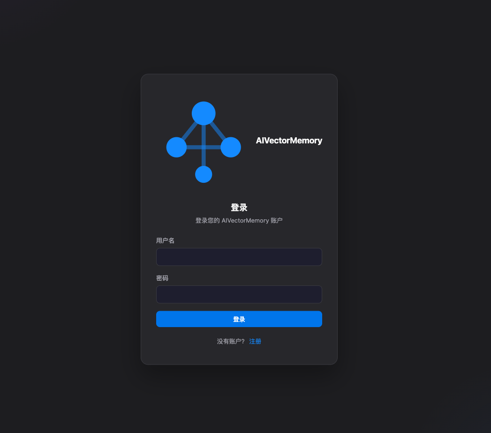
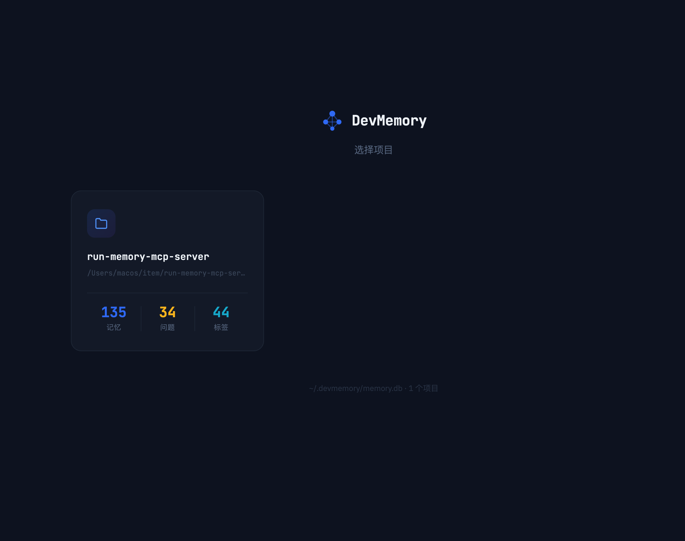
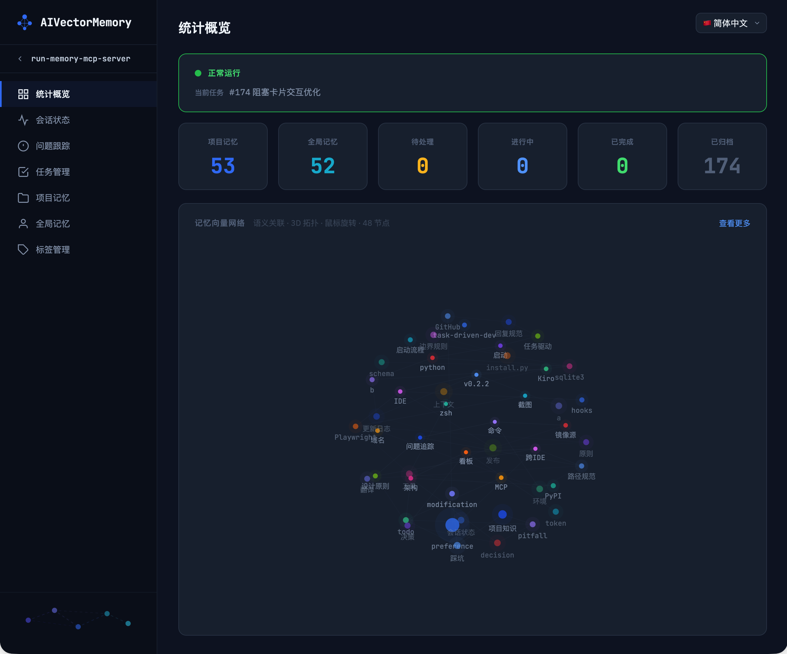

🌐 [简体中文](README.zh-CN.md) | [繁體中文](README.zh-TW.md) | [English](../README.md) | [Español](README.es.md) | Deutsch | [Français](README.fr.md) | [日本語](README.ja.md)

<p align="center">
  
</p>
<h1 align="center">AIVectorMemory</h1>
<p align="center">
  <strong>Gib deinem KI-Programmierassistenten ein Gedächtnis — Sitzungsübergreifender persistenter Speicher MCP Server</strong>
</p>
<p align="center">
  <a href="https://pypi.org/project/aivectormemory/"></a>
  <a href="https://pypi.org/project/aivectormemory/"></a>
  <a href="https://github.com/Edlineas/aivectormemory/blob/main/LICENSE"></a>
  <a href="https://modelcontextprotocol.io"></a>
</p>
---

> **Nutzt du immer noch CLAUDE.md / MEMORY.md als Gedächtnis?** Dieser Markdown-Datei-Ansatz hat fatale Schwächen: Die Datei wird immer größer, jede Sitzung injiziert alles und verbraucht massiv Tokens; Inhalte unterstützen nur Stichwortsuche — suche „Datenbank-Timeout" und du findest nicht „MySQL Connection Pool Fallstrick"; eine Datei für mehrere Projekte führt zu gegenseitiger Kontamination; es gibt kein Aufgaben-Tracking, der Entwicklungsfortschritt existiert nur in deinem Kopf; ganz zu schweigen von der 200-Zeilen-Kürzung, manueller Pflege und der Unmöglichkeit, Duplikate zu erkennen oder zusammenzuführen.
>
> **AIVectorMemory ist ein grundlegend anderer Ansatz.** Lokale Vektordatenbank-Speicherung mit semantischer Suche für präzisen Abruf (findet Übereinstimmungen auch bei unterschiedlicher Wortwahl), bedarfsgesteuerter Abruf lädt nur relevante Erinnerungen (Token-Verbrauch sinkt um 50%+), automatische Multi-Projekt-Isolation ohne Interferenz, und integriertes Problem-Tracking + Aufgabenverwaltung, die der KI ermöglicht, deinen Entwicklungsworkflow vollständig zu automatisieren. Alle Daten werden dauerhaft auf deinem Rechner gespeichert — null Cloud-Abhängigkeit, nichts geht verloren beim Wechsel von Sitzungen oder IDEs.

## ✨ Kernfunktionen

| Funktion | Beschreibung |
|----------|-------------|
| 🧠 **Sitzungsübergreifendes Gedächtnis** | Deine KI erinnert sich endlich an dein Projekt — Fehler, Entscheidungen, Konventionen bleiben über Sessions hinweg erhalten |
| 🔍 **Semantische Suche** | Kein exakter Wortlaut nötig — suche „Datenbank-Timeout" und finde „MySQL Connection Pool Problem" |
| 💰 **50%+ Tokens sparen** | Schluss mit Copy-Paste des Projektkontexts in jeder Konversation. Semantischer Abruf bei Bedarf statt Masseninjektion |
| 🔗 **Aufgabengesteuertes Dev** | Problem-Tracking → Aufgabenzerlegung → Status-Sync → verknüpfte Archivierung. KI verwaltet den gesamten Dev-Workflow |
| 📊 **Web-Dashboard** | Visuelle Verwaltung aller Erinnerungen und Aufgaben, 3D-Vektornetzwerk zeigt Wissensverbindungen auf einen Blick |
| 🏠 **Vollständig Lokal** | Null Cloud-Abhängigkeit. ONNX lokale Inferenz, kein API Key, Daten verlassen nie deinen Rechner |
| 🔌 **Alle IDEs** | Cursor / Kiro / Claude Code / Windsurf / VSCode / OpenCode / Trae / Codex — Ein-Klick-Installation, sofort einsatzbereit |
| 📁 **Multi-Projekt-Isolation** | Eine DB für alle Projekte, automatisch isoliert ohne Interferenz, nahtloser Projektwechsel |
| 🔄 **Intelligente Deduplizierung** | Ähnlichkeit > 0.95 führt automatisch zusammen, Wissensspeicher bleibt sauber — wird nie unübersichtlich |

<p align="center">
  QQ群：1085682431 &nbsp;|&nbsp; 微信：changhuibiz<br>
  共同参与项目开发加QQ群或微信交流
</p>

## 🏗️ Architektur

```
┌─────────────────────────────────────────────────┐
│                   AI IDE                         │
│  OpenCode / Codex / Claude Code / Cursor / ...  │
└──────────────────────┬──────────────────────────┘
                       │ MCP Protocol (stdio)
┌──────────────────────▼──────────────────────────┐
│              AIVectorMemory Server               │
│                                                  │
│  ┌──────────┐ ┌──────────┐ ┌──────────────────┐ │
│  │ remember │ │  recall   │ │   auto_save      │ │
│  │ forget   │ │  task     │ │   status/track   │ │
│  └────┬─────┘ └────┬─────┘ └───────┬──────────┘ │
│       │            │               │             │
│  ┌────▼────────────▼───────────────▼──────────┐  │
│  │         Embedding Engine (ONNX)            │  │
│  │      intfloat/multilingual-e5-small        │  │
│  └────────────────────┬───────────────────────┘  │
│                       │                          │
│  ┌────────────────────▼───────────────────────┐  │
│  │     SQLite + sqlite-vec (Vektorindex)      │  │
│  │     ~/.aivectormemory/memory.db            │  │
│  └────────────────────────────────────────────┘  │
└──────────────────────────────────────────────────┘
```

## 🚀 Schnellstart

### Option 1: pip Installation (Empfohlen)

```bash
# Installieren
pip install aivectormemory

# Auf neueste Version aktualisieren
pip install --upgrade aivectormemory

# In dein Projektverzeichnis wechseln, Ein-Klick-IDE-Setup
cd /path/to/your/project
run install
```

`run install` führt dich interaktiv durch die IDE-Auswahl und generiert automatisch MCP-Konfiguration, Steering-Regeln und Hooks — kein manuelles Setup nötig.

> **macOS-Benutzer beachten**:
> - Bei `externally-managed-environment` Fehler: `--break-system-packages` hinzufügen
> - Bei `enable_load_extension` Fehler: Dein Python unterstützt kein SQLite-Extension-Loading (macOS-Standard-Python und python.org-Installer unterstützen es nicht). Verwende Homebrew Python:
>   ```bash
>   brew install python
>   /opt/homebrew/bin/python3 -m pip install aivectormemory
>   ```

### Option 2: uvx (ohne Installation)

Kein `pip install` nötig, direkt ausführen:

```bash
cd /path/to/your/project
uvx aivectormemory install
```

> [uv](https://docs.astral.sh/uv/getting-started/installation/) muss installiert sein. `uvx` lädt das Paket automatisch herunter und führt es aus.

### Option 3: Manuelle Konfiguration

```json
{
  "mcpServers": {
    "aivectormemory": {
      "command": "run",
      "args": ["--project-dir", "/path/to/your/project"]
    }
  }
}
```

<details>
<summary>📍 Konfigurationsdatei-Pfade nach IDE</summary>

| IDE | Konfigurationspfad |
|-----|-------------------|
| Kiro | `.kiro/settings/mcp.json` |
| Cursor | `.cursor/mcp.json` |
| Claude Code | `.mcp.json` |
| Windsurf | `.windsurf/mcp.json` |
| VSCode | `.vscode/mcp.json` |
| Trae | `.trae/mcp.json` |
| OpenCode | `opencode.json` |
| Codex | `.codex/config.toml` |

</details>

Für Codex verwende projektbezogenes TOML statt JSON:

```toml
[mcp_servers.aivectormemory]
command = "run"
args = ["--project-dir", "/path/to/your/project"]
```

> Codex lädt die projektbezogene `.codex/config.toml` erst, nachdem das Repository als trusted project markiert wurde.

## 🛠️ 8 MCP-Werkzeuge

### `remember` — Erinnerung speichern

```
content (string, erforderlich)   Inhalt im Markdown-Format
tags    (string[], erforderlich)  Tags, z.B. ["fehler", "python"]
scope   (string)                  "project" (Standard) / "user" (projektübergreifend)
```

Ähnlichkeit > 0.95 aktualisiert automatisch bestehende Erinnerung, keine Duplikate.

### `recall` — Semantische Suche

```
query   (string)     Semantische Suchbegriffe
tags    (string[])   Exakter Tag-Filter
scope   (string)     "project" / "user" / "all"
top_k   (integer)    Anzahl der Ergebnisse, Standard 5
```

Vektorähnlichkeits-Matching — findet verwandte Erinnerungen auch bei unterschiedlicher Wortwahl.

### `forget` — Erinnerungen löschen

```
memory_id  (string)     Einzelne ID
memory_ids (string[])   Mehrere IDs
```

### `status` — Sitzungsstatus

```
state (object, optional)   Weglassen zum Lesen, übergeben zum Aktualisieren
  is_blocked, block_reason, current_task,
  next_step, progress[], recent_changes[], pending[]
```

Hält den Arbeitsfortschritt sitzungsübergreifend, stellt Kontext automatisch wieder her.

### `track` — Problem-Tracking

```
action   (string)   "create" / "update" / "archive" / "list"
title    (string)   Problemtitel
issue_id (integer)  Problem-ID
status   (string)   "pending" / "in_progress" / "completed"
content  (string)   Untersuchungsinhalt
```

### `task` — Aufgabenverwaltung

```
action     (string, erforderlich)  "batch_create" / "update" / "list" / "delete" / "archive"
feature_id (string)                Verknüpfte Funktionskennung (erforderlich für list)
tasks      (array)                 Aufgabenliste (batch_create, Unteraufgaben unterstützt)
task_id    (integer)               Aufgaben-ID (update)
status     (string)                "pending" / "in_progress" / "completed" / "skipped"
```

Über feature_id mit Spec-Dokumenten verknüpft. Update synchronisiert automatisch tasks.md Checkboxen und verknüpften Issue-Status.

### `readme` — README-Generierung

```
action   (string)    "generate" (Standard) / "diff" (Unterschiede vergleichen)
lang     (string)    Sprache: en / zh-TW / ja / de / fr / es
sections (string[])  Abschnitte angeben: header / tools / deps
```

Generiert automatisch README-Inhalte aus TOOL_DEFINITIONS / pyproject.toml, Mehrsprachigkeit unterstützt.

### `auto_save` — Automatisches Speichern von Präferenzen

```
preferences  (string[])  Vom Benutzer geäußerte technische Präferenzen (festes scope=user, projektübergreifend)
extra_tags   (string[])  Zusätzliche Tags
```

Extrahiert und speichert automatisch Benutzerpräferenzen am Ende jeder Konversation, intelligente Deduplizierung.

## 📊 Web-Dashboard

```bash
run web --port 9080
run web --port 9080 --quiet          # Anfrage-Logs unterdrücken
run web --port 9080 --quiet --daemon  # Im Hintergrund ausführen (macOS/Linux)
```

Besuche `http://localhost:9080` im Browser. Standardbenutzername `admin`, Passwort `admin123` (kann nach der ersten Anmeldung in den Einstellungen geändert werden).

- Mehrere Projekte wechseln, Erinnerungen durchsuchen/bearbeiten/löschen/exportieren/importieren
- Semantische Suche (Vektorähnlichkeits-Matching)
- Projektdaten mit einem Klick löschen
- Sitzungsstatus, Problem-Tracking
- Tag-Verwaltung (Umbenennen, Zusammenführen, Stapellöschung)
- Token-Authentifizierungsschutz
- 3D-Vektornetzwerk-Visualisierung
- 🌐 Mehrsprachige Unterstützung (简体中文 / 繁體中文 / English / Español / Deutsch / Français / 日本語)

<p align="center">
  
  <br>
  <em>Anmeldung</em>
</p>

<p align="center">
  
  <br>
  <em>Projektauswahl</em>
</p>

<p align="center">
  
  <br>
  <em>Übersicht & Vektornetzwerk-Visualisierung</em>
</p>

<p align="center">
  
  &nbsp;&nbsp;&nbsp;&nbsp;
  
  <br>
  <em>WeChat-Gruppe beitreten &nbsp;|&nbsp; QQ-Gruppe beitreten</em>
</p>

## ⚡ Kombination mit Steering-Regeln

AIVectorMemory ist die Speicherschicht. Verwende Steering-Regeln, um der KI mitzuteilen, **wann und wie** sie diese Tools aufrufen soll.

`run install` generiert automatisch Steering-Regeln und Hooks-Konfiguration — kein manuelles Setup nötig.

| IDE | Steering-Pfad | Hooks |
|-----|--------------|-------|
| Kiro | `.kiro/steering/aivectormemory.md` | `.kiro/hooks/*.hook` |
| Cursor | `.cursor/rules/aivectormemory.md` | `.cursor/hooks.json` |
| Claude Code | `CLAUDE.md` (angehängt) | `.claude/settings.json` |
| Windsurf | `.windsurf/rules/aivectormemory.md` | `.windsurf/hooks.json` |
| VSCode | `.github/copilot-instructions.md` (angehängt) | `.claude/settings.json` |
| Trae | `.trae/rules/aivectormemory.md` | — |
| OpenCode | `AGENTS.md` (angehängt) | `.opencode/plugins/*.js` |
| Codex | `AGENTS.md` (angehängt) | — |

<details>
<summary>📋 Steering-Regeln Beispiel (automatisch generiert)</summary>

```markdown
# AIVectorMemory - Workflow-Regeln

## 1. Neuer Sitzungsstart (in Reihenfolge ausführen)

1. `recall` (tags: ["Projektwissen"], scope: "project", top_k: 100) Projektwissen laden
2. `recall` (tags: ["preference"], scope: "user", top_k: 20) Benutzereinstellungen laden
3. `status` (ohne state-Parameter) Sitzungsstatus lesen
4. Blockiert → berichten und warten; Nicht blockiert → Verarbeitungsfluss starten

## 2. Nachrichtenverarbeitungsfluss

- Schritt A: `status` Status lesen, bei Blockierung warten
- Schritt B: Nachrichtentyp klassifizieren (Chat/Korrektur/Präferenz/Code-Problem)
- Schritt C: `track create` Problem erfassen
- Schritt D: Untersuchen (`recall` Fehler suchen + Code prüfen + Ursache finden)
- Schritt E: Plan dem Benutzer vorstellen, Blockierung setzen für Bestätigung
- Schritt F: Code ändern (vor Änderungen `recall` Fehler prüfen)
- Schritt G: Tests zur Verifizierung ausführen
- Schritt H: Blockierung setzen für Benutzerverifizierung
- Schritt I: Benutzer bestätigt → `track archive` + Blockierung aufheben

## 3. Blockierungsregeln

Bei Planvorschlägen oder Verifizierungswartung muss `status({ is_blocked: true })` gesetzt werden.
Nur nach expliziter Benutzerbestätigung aufheben. Niemals selbst aufheben.

## 4-9. Problemverfolgung / Code-Prüfung / Spec-Aufgabenverwaltung / Erinnerungsqualität / Werkzeugübersicht / Entwicklungsstandards

(Vollständige Regeln werden automatisch von `run install` generiert)
```

</details>

<details>
<summary>🔗 Hooks-Konfiguration Beispiel (nur Kiro, automatisch generiert)</summary>

Automatisches Speichern bei Sitzungsende entfernt. Entwicklungsworkflow-Prüfung (`.kiro/hooks/dev-workflow-check.kiro.hook`):

```json
{
  "enabled": true,
  "name": "Entwicklungsworkflow-Prüfung",
  "version": "1",
  "when": { "type": "promptSubmit" },
  "then": {
    "type": "askAgent",
    "prompt": "Kernprinzipien: Vor dem Handeln verifizieren, kein blindes Testen, erst nach bestandenen Tests als erledigt markieren"
  }
}
```

</details>

## 🇨🇳 Nutzer in China

Das Embedding-Modell (~200MB) wird beim ersten Start automatisch heruntergeladen. Falls langsam:

```bash
export HF_ENDPOINT=https://hf-mirror.com
```

Oder env in der MCP-Konfiguration hinzufügen:

```json
{
  "env": { "HF_ENDPOINT": "https://hf-mirror.com" }
}
```

## 📦 Technologie-Stack

| Komponente | Technologie |
|------------|-----------|
| Laufzeit | Python >= 3.10 |
| Vektor-DB | SQLite + sqlite-vec |
| Embedding | ONNX Runtime + intfloat/multilingual-e5-small |
| Tokenizer | HuggingFace Tokenizers |
| Protokoll | Model Context Protocol (MCP) |
| Web | Nativer HTTPServer + Vanilla JS |

## 📋 Änderungsprotokoll

### v2.1.4

**Fix: Sichtbarkeit ersetzter Erinnerungen**
- 🔓 Harten Filter entfernt, der ersetzte Erinnerungen vollständig aus Recall-Ergebnissen ausblendete — zuvor blockierte `exclude_superseded=true` (Standard) Erinnerungen vor der Bewertung und machte sie dauerhaft unsichtbar
- 📊 Ersetzte Erinnerungen werden jetzt natürlich durch importance-Reduktion (`×0.3`) + `sqrt(importance)`-Bewertung eingestuft — sie erscheinen weiter unten in den Ergebnissen statt vollständig zu verschwinden
- 🧹 Funktion `_load_superseded_ids` und zugehörigen toten Code entfernt

### v2.1.3

**Fix: Überarbeitung der Scoring-Engine**
- 🧮 Kritischen Bug behoben: Composite-Score verwendet jetzt die originale Vektor-Ähnlichkeit statt des RRF-Rang-Scores — zuvor wurde eine Ähnlichkeit von ~0.8 durch einen RRF-Score von ~0.015 ersetzt, was das semantische Relevanzsignal zerstörte
- √ importance von direktem Multiplikator zu `sqrt(importance)` geändert — reduziert extreme Bestrafung (0.15 → 0.387 statt 0.15) bei Beibehaltung der Supersede-Unterdrückung
- 🛡️ Ähnlichkeits-Mindestgrenze: Erinnerungen mit Ähnlichkeit ≥ 0.85 erhalten eine garantierte Mindestpunktzahl, um zu verhindern, dass hochrelevante Erinnerungen durch niedrige importance vergraben werden
- ⚖️ Neugewichtung: similarity 0.55 (vorher 0.5), recency 0.30, frequency 0.15 (vorher 0.2) — semantische Relevanz dominiert jetzt das Ranking
- 📉 FTS-only-Fallback von 0.5 auf 0.3 reduziert — reine Keyword-Treffer erhalten keine aufgeblähten Ähnlichkeitswerte mehr

### v2.1.2

**Fehlerbehebung: Genauigkeit der Gedächtnis-Abfrage**
- 🔍 Gieriger Abbruch bei gestufter Suche behoben: `long_term`-Ergebnisse blockierten die Suche nach `short_term`-Erinnerungen, wodurch hochrelevante Erinnerungen unsichtbar waren
- 🔧 Beide Stufen werden nun gleichzeitig durchsucht, sortiert nach kombinierter Bewertung (Ähnlichkeit × Aktualität × Häufigkeit × Wichtigkeit)
- 🛡️ Bug bei der Mutation des `filters`-Dictionarys in `_search_tier` behoben

### v2.1.1

**Verbesserung: AI-Regelsystem-Upgrade**
- 📋 CLAUDE.md vervollständigt: Identität und Tonfall (§1), 7 Kernprinzipien (§3), Nachrichtentyp-Beurteilungsbeispiele, IDE-Sicherheit und Selbsttest-Abschnitte erweitert
- ⚠️ Hook mit Häufige-Verstöße-Erinnerung ergänzt: ❌ Negativbeispiele zur Verstärkung der 4 am häufigsten vergessenen Regeln (Selbsttest, Recall, Track Create, IDE-Sicherheit)
- 🌐 Alle 7 Sprach-Regeldateien synchron aktualisiert (zh-CN/zh-TW/en/ja/es/de/fr)
- 🔢 CLAUDE.md-Abschnitte auf §1–§11 umnummeriert, Querverweise aktualisiert

### v2.1.0

**Neu: Smart Memory Engine + Deinstallation**
- 🧠 FTS5-Volltextsuche mit chinesischer Tokenisierung (jieba) — Stichwortsuche funktioniert jetzt korrekt für CJK-Inhalte
- 🔀 Hybridsuche: Vektor + FTS5 Dual-Path mit RRF (Reciprocal Rank Fusion) Zusammenführung
- 📊 Zusammengesetzte Bewertung: Ähnlichkeit×0,5 + Aktualität×0,3 + Häufigkeit×0,2, gewichtet nach Wichtigkeit
- ⚡ Konflikterkennung: Ähnliche Erinnerungen (0,85–0,95) werden automatisch als ersetzt markiert, alte Fakten verblassen automatisch
- 📦 Speicherebenen: Häufig abgerufene Erinnerungen werden automatisch zu long_term befördert und priorisiert durchsucht
- 🗑️ Auto-Archivierung: Abgelaufene Kurzzeiteinnerungen (90 Tage inaktiv + geringe Wichtigkeit) werden automatisch bereinigt
- 🔗 Beziehungserweiterung: Tag-Überlappung ≥ 2 erstellt automatisch Verknüpfungen, 1-Hop-Erweiterung findet verwandte Erinnerungen
- 📝 Auto-Zusammenfassung: Lange Erinnerungen (>500 Zeichen) erhalten Zusammenfassungen, Brief-Modus gibt Zusammenfassungen zurück um Token zu sparen
- 🧹 Code-Bereinigung: 15 tote Code-Elemente entfernt, 7 duplizierte Muster in gemeinsame Utilities refaktorisiert
- ❌ `run uninstall` — Entfernt sauber alle IDE-Konfigurationen (MCP, Steering, Hooks, Berechtigungen) unter Beibehaltung der Speicherdaten

### v2.0.9

**Verbesserung: Sicherheit & Regeloptimierung**
- 🔒 SQL-Injection, Command-Injection und Path-Traversal-Schwachstellen behoben
- 🛡️ Transaktionsschutz für Datenintegrität hinzugefügt (Archivierung, Einfügen, Aktualisierung)
- 🧠 Ähnlichkeitsformel über alle Suchpfade vereinheitlicht
- 📏 AI-Workflow-Regeln um 38% komprimiert (219→136 Zeilen) ohne Prozessentfernung
- 🧹 v12-Migration bereinigt automatisch alte Müll-Erinnerungen
- 🌐 Alle 7 Sprachen synchronisiert

### v2.0.8

**Neu: Integrierter Playwright Browser-Test**
- 🎭 `run install` konfiguriert jetzt automatisch Playwright Browser-Tests — KI kann einen echten Browser öffnen um Frontend-Änderungen zu überprüfen
- 🎭 Verwendet einen dedizierten Testbrowser (Chrome for Testing), der Ihre persönlichen Browser-Tabs nicht beeinträchtigt
- 🔑 Vereinfachte Berechtigungskonfiguration — keine Berechtigungs-Popups mehr für gängige Tools
- 📏 KI-Regeln in allen 7 Sprachen aktualisiert um korrektes Browser-Testverhalten durchzusetzen

### v2.0.7

**Verbesserung: Mehr IDE-Unterstützung**
- 🖥️ Unterstützung für Antigravity und GitHub Copilot IDEs hinzugefügt
- 🔑 `run install` konfiguriert Tool-Berechtigungen automatisch
- 📏 KI-Selbsttest-Regeln vereinfacht

### v2.0.6

**Verbesserung: Schnellerer Start**
- ⚡ Optimierte Speicherladung beim Sitzungsstart — schnellerer Start mit geringerem Kontextverbrauch
- 🔑 Automatische Konfiguration der Claude Code Berechtigungen bei Installation
- 🌐 7 Sprachen synchronisiert

### v2.0.5

**Verbesserung: Vereinfachte Regeln**
- 📏 KI-Workflow-Regeln für Klarheit umstrukturiert und Token-Verbrauch reduziert
- 💾 KI speichert jetzt automatisch Ihre Präferenzen am Ende jeder Sitzung
- 🌐 7 Sprachen synchronisiert

### v2.0.4

**Fix: Tool-Zuverlässigkeit**
- 🔧 Umfassende Überprüfung und Korrektur aller MCP-Tool-Parameter

### v2.0.3

**Verbesserung: Bessere Suche & Sicherheit**
- 🔍 Speichersuche kombiniert jetzt semantische und Schlüsselwort-Übereinstimmung für genauere Ergebnisse
- 🛡️ Projektübergreifender Operationsschutz hinzugefügt

### v2.0.2

**Verbesserung: Regelverallgemeinerung & Desktop-Versionsanzeige-Fix**
- 📏 Neue Regel „recall vor Benutzerfrage" — KI muss das Gedächtnissystem abfragen bevor sie den Benutzer nach Projektinformationen fragt (Serveradresse, Passwörter, Deployment-Konfiguration usw.)
- 📏 Vor-Operations-Prüfungsregel verallgemeinert — spezifische Beispiele entfernt, gilt für alle Szenarien
- 🖥️ Desktop-App Einstellungsseite zeigte hartcodierte Version "1.0.0" statt der tatsächlichen Version — behoben
- 🌐 Steuerungsregeln und Workflow-Prompts in allen 7 Sprachen synchronisiert

### v2.0.1

**Fix: Hook-Kompatibilität über Projekte hinweg**
- 🔧 `check_track.sh` leitet den Projektpfad nun vom Skriptstandort ab statt von `$(pwd)`, behebt Track-Erkennungsfehler wenn Claude Code Hooks aus einem anderen Arbeitsverzeichnis ausführt
- 🔧 `compact-recovery.sh` verwendet nun relative Pfadableitung statt hartcodierter absoluter Pfade
- 🔧 Redundante CLAUDE.md-Reinjektion aus compact-recovery entfernt (wird bereits automatisch geladen)
- 🔧 `install.py`-Vorlage mit allen Hook-Fixes synchronisiert
- 🌐 Compact-Recovery-Hinweistexte in allen 7 Sprachen aktualisiert

### v2.0

**Leistung: ONNX INT8-Quantisierung**
- ⚡ Embedding-Modell wird beim ersten Laden automatisch von FP32 auf INT8 quantisiert, Modelldatei von 448MB auf 113MB reduziert
- ⚡ MCP Server Speicherverbrauch von ~1,6GB auf ~768MB reduziert (über 50% Reduktion)
- ⚡ Quantisierung ist für Benutzer transparent — automatisch beim ersten Einsatz, gecacht für spätere Ladevorgänge, Fallback auf FP32 bei Fehler

**Neu: Passwort merken**
- 🔐 Anmeldeseite auf Desktop und Web-Dashboard hat jetzt eine "Passwort merken"-Checkbox
- 🔐 Bei Aktivierung werden Anmeldedaten im localStorage gespeichert und beim nächsten Login automatisch ausgefüllt; bei Deaktivierung werden gespeicherte Daten gelöscht
- 🔐 Checkbox ist im Registrierungsmodus ausgeblendet

**Verstärkung: Steering-Regeln**
- 📝 IDENTITY & TONE-Abschnitt mit spezifischeren Einschränkungen verstärkt (keine Höflichkeitsfloskeln, keine Übersetzung von Benutzernachrichten usw.)
- 📝 Selbsttest-Anforderungen unterscheiden nun zwischen reinem Backend, MCP Server und Frontend-sichtbaren Änderungen (Playwright für Frontend erforderlich)
- 📝 Entwicklungsregeln schreiben nun Selbsttest nach Fertigstellung vor
- 📝 Alle 7 Sprachversionen synchronisiert

### v1.0.11

- 🐛 Desktop-Versionsvergleich auf semantische Versionierung umgestellt, falsche Upgrade-Meldungen bei höherer lokaler Version behoben
- 🐛 Feldnamen der Gesundheitsprüfungsseite mit Backend abgeglichen, Konsistenzstatus zeigte immer Mismatch an — behoben
- 🔧 check_track.sh Hook mit Python-Fallback ergänzt, behebt stilles Hook-Versagen ohne System-sqlite3 (#4)

### v1.0.10

- 🖥️ Desktop-App Ein-Klick-Installation + Upgrade-Erkennung
- 🖥️ Automatische Erkennung des Python- und aivectormemory-Installationsstatus beim Start
- 🖥️ Ein-Klick-Installationsbutton bei fehlender Installation, Erkennung neuer PyPI- und Desktop-Versionen bei vorhandener Installation
- 🐛 Installationserkennung auf importlib.metadata.version() umgestellt für genaue Paketversion

### v1.0.3

**recall Suchoptimierung**
- 🔍 `recall` neuer Parameter `tags_mode`: `any` (OR-Abgleich) / `all` (AND-Abgleich)
- 🔍 `query + tags` verwendet standardmäßig OR-Abgleich (jeder Tag-Treffer wird Kandidat), behebt fehlende Ergebnisse bei mehreren Tags
- 🔍 Nur `tags` behält AND-Abgleich (präzise Kategorienavigation), abwärtskompatibel
- 📝 Steering-Regeln mit Suchrichtlinien aktualisiert

### v0.2.8

**Web-Dashboard**
- 📋 Archivierte Problem-Detailansicht: Klick auf archivierte Karte zeigt schreibgeschützte Details (alle strukturierten Felder: Untersuchung/Ursache/Lösung/Testergebnis/geänderte Dateien), roter Lösch-Button unten für permanente Löschung

**Steering-Regeln Verstärkung**
- 📝 `track create` erfordert jetzt `content`-Feld (Problemsymptome und Kontext beschreiben), nur Titel ohne Inhalt verboten
- 📝 `track update` nach Untersuchung erfordert `investigation` und `root_cause` Felder
- 📝 `track update` nach Behebung erfordert `solution`, `files_changed` und `test_result` Felder
- 📝 Abschnitt 4 fügt Unterabschnitt "Feldausfüllstandards" mit Pflichtfeldern pro Phase hinzu
- 📝 Abschnitt 5 von "Code-Änderungsprüfung" zu "Vor-Operations-Prüfung" erweitert, recall-Regel für Fehlerprotokolle vor Dashboard-Start/PyPI-Veröffentlichung/Service-Neustart hinzugefügt
- 📝 `install.py` STEERING_CONTENT mit allen Änderungen synchronisiert

**Tool-Optimierung**
- 🔧 `track`-Tool `content`-Feldbeschreibung von "Untersuchungsinhalt" zu "Problembeschreibung (bei create erforderlich)" geändert

### v0.2.7

**Automatische Schlüsselwort-Extraktion**
- 🔑 `remember`/`auto_save` extrahieren automatisch Schlüsselwörter aus dem Inhalt und ergänzen die Tags — KI muss keine vollständigen Tags mehr manuell übergeben
- 🔑 Verwendet jieba chinesische Wortsegmentierung + englische Regex-Extraktion, präzise Schlüsselwort-Extraktion für gemischte chinesisch-englische Inhalte
- 🔑 Neue Abhängigkeit `jieba>=0.42`

### v0.2.6

**Steering-Regeln Umstrukturierung**
- 📝 Steering-Regeldokument von alter 3-Abschnitt-Struktur auf 9-Abschnitt-Struktur umgeschrieben (Sitzungsstart / Nachrichtenverarbeitung / Blockierungsregeln / Problemverfolgung / Code-Überprüfung / Spec-Aufgabenverwaltung / Speicherqualität / Werkzeugreferenz / Entwicklungsstandards)
- 📝 `install.py` STEERING_CONTENT-Vorlage synchronisiert, neue Projekte erhalten aktualisierte Regeln bei Installation
- 📝 Tags von festen Listen auf dynamische Extraktion umgestellt (Schlüsselwörter aus Inhalt extrahiert), verbesserte Speicherabrufgenauigkeit

**Fehlerbehebungen**
- 🐛 `readme`-Tool `handle_readme()` fehlte `**_`, verursachte MCP-Aufruffehler `unexpected keyword argument 'engine'`
- 🐛 Web-Dashboard Speichersuche-Paginierung behoben (vollständige Filterung vor Paginierung bei Suchanfrage, behebt unvollständige Suchergebnisse)

**Dokumentationsaktualisierungen**
- 📖 README Werkzeuganzahl 7→8, Architekturdiagramm `digest`→`task`, `task`/`readme` Werkzeugbeschreibungen hinzugefügt
- 📖 `auto_save`-Parameter von `decisions[]/modifications[]/pitfalls[]/todos[]` auf `preferences[]/extra_tags[]` aktualisiert
- 📖 Steering-Regelbeispiel von 3-Abschnitt-Format auf 9-Abschnitt-Strukturzusammenfassung aktualisiert
- 📖 Aktualisierungen über 6 Sprachversionen synchronisiert

### v0.2.5

**Aufgabengesteuerter Entwicklungsmodus**
- 🔗 Issue-Tracking (track) und Aufgabenverwaltung (task) über `feature_id` zu einem vollständigen Workflow verbunden: Problem entdecken → Aufgaben erstellen → Aufgaben ausführen → Status automatisch synchronisieren → verknüpfte Archivierung
- 🔄 `task update` synchronisiert bei Statusänderung automatisch den verknüpften Issue-Status (alle abgeschlossen→completed, in Bearbeitung→in_progress)
- 📦 `track archive` archiviert bei Issue-Archivierung automatisch verknüpfte Aufgaben (ausgelöst beim letzten aktiven Issue)
- 📦 `task`-Werkzeug mit neuem `archive`-Aktion, verschiebt alle Aufgaben einer Funktionsgruppe in die `tasks_archive`-Tabelle
- 📊 Issue-Karten zeigen verknüpften Aufgabenfortschritt (z.B. `5/10`), Aufgabenseite unterstützt Archiv-Filterung

**Neue Werkzeuge**
- 🆕 `task`-Werkzeug — Aufgabenverwaltung (batch_create/update/list/delete/archive), Baumstruktur-Unteraufgaben, über feature_id mit Spec-Dokumenten verknüpft
- 🆕 `readme`-Werkzeug — README-Inhalte automatisch aus TOOL_DEFINITIONS/pyproject.toml generieren, Mehrsprachigkeit und Diff-Vergleich

**Werkzeug-Erweiterungen**
- 🔧 `track` mit delete-Aktion, 9 strukturierten Feldern (description/investigation/root_cause/solution/test_result/notes/files_changed/feature_id/parent_id), list nach issue_id für Einzelabfrage
- 🔧 `recall` mit source-Parameterfilterung (manual/auto_save) und brief-Modus (nur content+tags, spart Kontext)
- 🔧 `auto_save` markiert Erinnerungen mit source="auto_save", unterscheidet manuelle Erinnerungen von automatischen Speicherungen

**Wissensdatenbank-Tabellenaufteilung**
- 🗃️ project_memories + user_memories als unabhängige Tabellen, eliminiert scope/filter_dir-Mischabfragen, verbesserte Abfrageleistung
- 📊 DB Schema v4→v6: issues mit 9 strukturierten Feldern + tasks/tasks_archive-Tabellen + memories.source-Feld

**Web-Dashboard**
- 📊 Startseite mit Blockierungsstatus-Karte (rot blockiert/grün normal), Klick springt zur Sitzungsstatus-Seite
- 📊 Neue Aufgabenverwaltungsseite (Funktionsgruppen ein-/ausklappen, Statusfilter, Suche, CRUD)
- 📊 Seitenleisten-Navigation optimiert (Sitzungsstatus, Probleme, Aufgaben an Kernpositionen verschoben)
- 📊 Erinnerungsliste mit source-Filterung und exclude_tags-Ausschlussfilter

**Stabilität & Standards**
- 🛡️ Server-Hauptschleife mit globaler Ausnahmebehandlung, einzelne Nachrichtenfehler beenden den Server nicht mehr
- 🛡️ Protocol-Schicht mit Leerzeilen-Überspringung und JSON-Parse-Fehlertoleranz
- 🕐 Zeitstempel von UTC auf lokale Zeitzone geändert
- 🧹 Bereinigung redundanten Codes (entfernte ungenutzte Methoden, redundante Importe, Backup-Dateien)
- 📝 Steering-Vorlage mit Spec-Workflow und Aufgabenverwaltungs-Abschnitt, context transfer Fortsetzungsregeln

### v0.2.4

- 🔇 Stop-Hook-Prompt auf direkte Anweisung geändert, Claude Code doppelte Antworten eliminiert
- 🛡️ Steering-Regeln auto_save Spezifikation mit Kurzschluss-Schutz, überspringt andere Regeln bei Sitzungsende
- 🐛 `_copy_check_track_script` Idempotenz-Fix (Änderungsstatus zurückgeben, falsche "synchronisiert"-Meldungen vermeiden)
- 🐛 issue_repo delete `row.get()` Inkompatibilität mit `sqlite3.Row` behoben (Verwendung von `row.keys()`)
- 🐛 Web-Dashboard Projektauswahl-Seite Scroll-Fix (Scrollen bei vielen Projekten nicht möglich)
- 🐛 Web-Dashboard CSS-Verschmutzung behoben (strReplace globale Ersetzung beschädigte 6 Style-Selektoren)
- 🔄 Web-Dashboard alle confirm()-Dialoge durch benutzerdefiniertes showConfirm-Modal ersetzt (Erinnerung/Issue/Tag/Projekt löschen)
- 🔄 Web-Dashboard Löschoperationen mit API-Fehlerantwort-Behandlung (Toast statt Alert)
- 🧹 `.gitignore` ergänzt `.devmemory/` Legacy-Verzeichnis Ignorierregel
- 🧪 pytest temporäre Projekt-DB-Reste automatische Bereinigung (conftest.py Session-Fixture)

### v0.2.3

- 🛡️ PreToolUse Hook: Erzwungene Track-Issue-Prüfung vor Edit/Write, Ablehnung ohne aktive Issues (Claude Code / Kiro / OpenCode)
- 🔌 OpenCode-Plugin auf `@opencode-ai/plugin` SDK-Format aktualisiert (tool.execute.before Hook)
- 🔧 `run install` deployt check_track.sh automatisch mit dynamischer Pfadinjektion
- 🐛 issue_repo archive/delete `row.get()` Inkompatibilität mit `sqlite3.Row` behoben
- 🐛 session_id Race-Condition behoben: Neuester Wert aus DB lesen vor Inkrementierung
- 🐛 Track date Formatvalidierung (YYYY-MM-DD) + issue_id Typvalidierung hinzugefügt
- 🐛 Web-API Anfrageparsing gehärtet (Content-Length Validierung + 10MB Limit + JSON Fehlerbehandlung)
- 🐛 Tag-Filter Scope-Logik behoben (`filter_dir is not None` statt Falsy-Prüfung)
- 🐛 Export Vektordaten struct.unpack Bytelängen-Validierung hinzugefügt
- 🐛 Schema versionierte Migration (schema_version Tabelle + v1/v2/v3 inkrementelle Migration)
- 🐛 `__init__.py` Versionsnummer-Synchronisation behoben

### v0.2.2

- 🔇 Web-Dashboard `--quiet` Parameter zum Unterdrücken von Anfrage-Logs
- 🔄 Web-Dashboard `--daemon` Parameter für Hintergrundausführung (macOS/Linux)
- 🔧 `run install` MCP-Konfigurationsgenerierung behoben (sys.executable + vollständige Felder)
- 📋 Issue-Tracking CRUD & Archivierung (Web-Dashboard Hinzufügen/Bearbeiten/Archivieren/Löschen + Erinnerungsverknüpfung)
- 👆 Klick auf beliebige Stelle in Listenzeile öffnet Bearbeitungs-Modal (Erinnerungen/Issues/Tags)
- 🔒 Blockierungsregeln bei Sitzungsfortsetzungen/Kontexttransfers erzwungen (erneute Bestätigung erforderlich)

### v0.2.1

- ➕ Projekte vom Web-Dashboard hinzufügen (Verzeichnis-Browser + manuelle Eingabe)
- 🏷️ Tag-Kreuzkontamination behoben (Tag-Operationen auf aktuelles Projekt + globale Erinnerungen beschränkt)
- 📐 Modal-Paginierung mit Auslassungszeichen + 80% Breite
- 🔌 OpenCode install generiert automatisch auto_save-Plugin (session.idle Event-Trigger)
- 🔗 Claude Code / Cursor / Windsurf install generiert automatisch Hooks-Konfiguration (automatisches Speichern bei Sitzungsende)
- 🎯 Web-Dashboard UX-Verbesserungen (Toast-Feedback, Leerstandsführungen, Export/Import-Toolbar)
- 🔧 Statistik-Karten Klick-Navigation (Klick auf Erinnerungs-/Problemzähler für Details)
- 🏷️ Tag-Verwaltungsseite unterscheidet Projekt-/Globale Tag-Quellen (📁/🌐 Markierungen)
- 🏷️ Projekt-Karten Tag-Anzahl enthält jetzt globale Erinnerungs-Tags

### v0.2.0

- 🔐 Web-Dashboard Token-Authentifizierung
- ⚡ Embedding-Vektor-Cache, keine redundante Berechnung für identische Inhalte
- 🔍 recall unterstützt kombinierte query + tags Suche
- 🗑️ forget unterstützt Stapellöschung (memory_ids Parameter)
- 📤 Erinnerungs-Export/Import (JSON-Format)
- 🔎 Semantische Suche im Web-Dashboard
- 🗂️ Projekt-Löschbutton im Web-Dashboard
- 📊 Web-Dashboard Leistungsoptimierung (vollständige Tabellenscans eliminiert)
- 🧠 digest intelligente Komprimierung
- 💾 session_id Persistenz
- 📏 content Längenbegrenzungsschutz
- 🏷️ version dynamische Referenz (nicht mehr hartcodiert)

### v0.1.x

- Erstveröffentlichung: 7 MCP-Werkzeuge, Web-Dashboard, 3D-Vektorvisualisierung, Mehrsprachigkeit

## License

Apache-2.0
