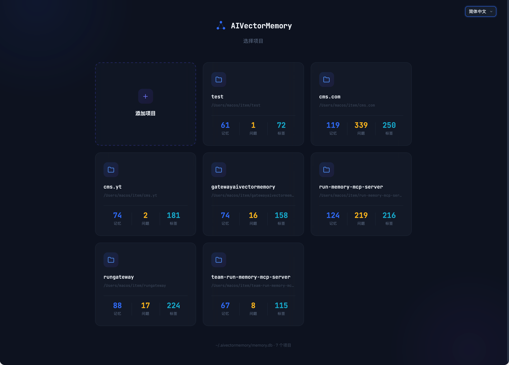
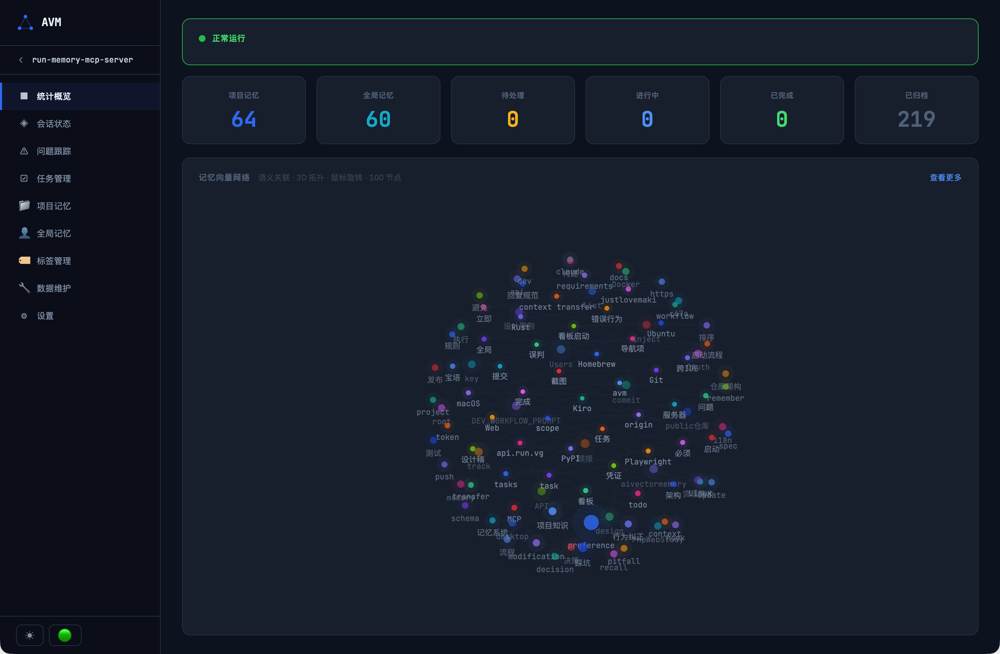

🌐 简体中文 | [繁體中文](README.zh-TW.md) | [English](../README.md) | [Español](README.es.md) | [Deutsch](README.de.md) | [Français](README.fr.md) | [日本語](README.ja.md)

<p align="center">
  
</p>

<p align="center">
  
</p>
<h1 align="center">AIVectorMemory</h1>
<p align="center">
  <strong>给 AI 编程助手装上记忆 — 跨会话持久化记忆 MCP Server</strong>
</p>
<p align="center">
  <a href="https://pypi.org/project/aivectormemory/"></a>
  <a href="https://pypi.org/project/aivectormemory/"></a>
  <a href="https://github.com/Edlineas/aivectormemory/blob/main/LICENSE"></a>
  <a href="https://modelcontextprotocol.io"></a>
</p>

---

> **你还在用 CLAUDE.md / MEMORY.md 当记忆？** 这类 Markdown 文件记忆模式有致命缺陷：文件越写越大，每次会话全量注入吃掉大量 Token；内容只能关键词匹配，搜"数据库超时"找不到"MySQL 连接池踩坑"；多项目共用一个文件互相污染；没有任务追踪，开发进度全靠人脑记；更别提 200 行截断、手动维护、无法去重合并这些日常痛点了。
>
> **AIVectorMemory 是完全不同的方案。** 本地向量数据库存储，语义搜索精准召回（用词不同也能匹配），按需检索只加载相关记忆（Token 消耗直降 50%+），多项目自动隔离互不干扰，内置问题追踪 + 任务管理让 AI 全自动管理开发流程。所有数据永久保存在你的电脑上，零云依赖，换会话、换 IDE 都不丢。

## ✨ 核心特性


| 特性 | 说明 |
|------|------|
| 🧠 **跨会话记忆** | 踩过的坑、做过的决策、定下的规范，换个会话照样记得，AI 终于不再失忆 |
| 🔍 **语义搜索** | 向量相似度匹配，搜"数据库超时"就能找到"MySQL 连接池踩坑"，用词不同也能精准召回 |
| 💰 **省 50%+ Token** | 语义检索按需召回，告别每次对话复制粘贴项目背景的全量上下文注入 |
| 🔗 **任务驱动开发** | 问题追踪 → 任务拆分 → 状态同步 → 联动归档，AI 全自动管理完整开发流程 |
| 📊 **桌面端 + Web 看板** | 原生桌面应用（macOS/Windows/Linux）+ Web 看板，可视化管理记忆和任务，3D 向量网络一眼看清知识关联 |
| 🏠 **完全本地** | 零依赖云服务，ONNX 本地推理，无需 API Key，数据不出你的电脑 |
| 🔌 **全 IDE 通吃** | Cursor / Kiro / Claude Code / Windsurf / VSCode / OpenCode / Trae / Codex — 一键安装，开箱即用 |
| 📁 **多项目隔离** | 一个 DB 管所有项目，自动隔离互不干扰，切换项目无感知 |
| 🔄 **智能去重** | 相似度 > 0.95 自动合并更新，记忆库永远干净，不会越用越乱 |
| 🌐 **7 语言支持** | 简体中文 / 繁體中文 / English / Español / Deutsch / Français / 日本語，看板 + Steering 全栈国际化 |

<p align="center">
  QQ群：1085682431 &nbsp;|&nbsp; 微信：changhuibiz<br>
  共同参与项目开发加QQ群或微信交流
</p>
<p align="center">
  
  <br>
  <em>登录界面</em>
</p>

<p align="center">
  
  <br>
  <em>项目选择</em>
</p>

<p align="center">
  
  <br>
  <em>统计概览 & 向量网络可视化</em>
</p>

## 🏗️ 架构

```
┌─────────────────────────────────────────────────┐
│                   AI IDE                         │
│  OpenCode / Codex / Claude Code / Cursor / ...  │
└──────────────────────┬──────────────────────────┘
                       │ MCP Protocol (stdio)
┌──────────────────────▼──────────────────────────┐
│              AIVectorMemory Server                    │
│                                                  │
│  ┌──────────┐ ┌──────────┐ ┌──────────────────┐ │
│  │ remember │ │  recall   │ │   auto_save      │ │
│  │ forget   │ │  task     │ │   status/track   │ │
│  └────┬─────┘ └────┬─────┘ └───────┬──────────┘ │
│       │            │               │             │
│  ┌────▼────────────▼───────────────▼──────────┐  │
│  │         Embedding Engine (ONNX)            │  │
│  │      intfloat/multilingual-e5-small        │  │
│  └────────────────────┬───────────────────────┘  │
│                       │                          │
│  ┌────────────────────▼───────────────────────┐  │
│  │     SQLite + sqlite-vec (向量索引)          │  │
│  │     ~/.aivectormemory/memory.db                 │  │
│  └────────────────────────────────────────────┘  │
└──────────────────────────────────────────────────┘
```


## 🚀 快速开始

### 方式一：pip 安装（推荐）

```bash
# 安装
pip install aivectormemory

# 升级到最新版
pip install --upgrade aivectormemory

# 进入你的项目目录，一键配置 IDE
cd /path/to/your/project
run install
```

`run install` 会交互式引导你选择 IDE，自动生成 MCP 配置、Steering 规则和 Hooks，无需手动编写。

> **macOS 用户注意**：
> - 遇到 `externally-managed-environment` 错误，加 `--break-system-packages`
> - 遇到 `enable_load_extension` 错误，说明当前 Python 不支持 SQLite 扩展加载（macOS 自带 Python 和 python.org 官方安装包均不支持），请改用 Homebrew Python：
>   ```bash
>   brew install python
>   /opt/homebrew/bin/python3 -m pip install aivectormemory
>   ```

### 方式二：uvx 运行（零安装）

无需 `pip install`，直接运行：

```bash
cd /path/to/your/project
uvx aivectormemory install
```

> 需要先安装 [uv](https://docs.astral.sh/uv/getting-started/installation/)，`uvx` 会自动下载并运行，无需手动安装包。

### 方式三：手动配置

```json
{
  "mcpServers": {
    "aivectormemory": {
      "command": "run",
      "args": ["--project-dir", "/path/to/your/project"]
    }
  }
}
```

<details>
<summary>📍 各 IDE 配置文件位置</summary>

| IDE | 配置文件路径 |
|-----|------------|
| Kiro | `.kiro/settings/mcp.json` |
| Cursor | `.cursor/mcp.json` |
| Claude Code | `.mcp.json` |
| Windsurf | `.windsurf/mcp.json` |
| VSCode | `.vscode/mcp.json` |
| Trae | `.trae/mcp.json` |
| OpenCode | `opencode.json` |
| Codex | `.codex/config.toml` |

</details>

Codex 使用项目级 TOML 配置，而不是 JSON：

```toml
[mcp_servers.aivectormemory]
command = "run"
args = ["--project-dir", "/path/to/your/project"]
```

> 只有把仓库标记为 trusted project 后，Codex 才会加载项目级 `.codex/config.toml`。

## 🛠️ 8 个 MCP 工具

### `remember` — 存入记忆

```
content (string, 必填)   记忆内容，Markdown 格式
tags    (string[], 必填)  标签，如 ["踩坑", "python"]
scope   (string)          "project"（默认）/ "user"（跨项目）
```

相似度 > 0.95 自动更新已有记忆，不重复存储。

### `recall` — 语义搜索

```
query   (string)     语义搜索关键词
tags    (string[])   标签精确过滤
scope   (string)     "project" / "user" / "all"
top_k   (integer)    返回数量，默认 5
```

向量相似度匹配，用词不同也能找到相关记忆。

### `forget` — 删除记忆

```
memory_id  (string)     单个 ID
memory_ids (string[])   批量 ID
```

### `status` — 会话状态

```
state (object, 可选)   不传=读取，传=更新
  is_blocked, block_reason, current_task,
  next_step, progress[], recent_changes[], pending[]
```

跨会话保持工作进度，新会话自动恢复上下文。

### `track` — 问题跟踪

```
action   (string)   "create" / "update" / "archive" / "list"
title    (string)   问题标题
issue_id (integer)  问题 ID
status   (string)   "pending" / "in_progress" / "completed"
content  (string)   排查内容
```

### `task` — 任务管理

```
action     (string, 必填)  "batch_create" / "update" / "list" / "delete" / "archive"
feature_id (string)        关联功能标识（list 时必填）
tasks      (array)         任务列表（batch_create，支持子任务）
task_id    (integer)       任务 ID（update）
status     (string)        "pending" / "in_progress" / "completed" / "skipped"
```

通过 feature_id 关联 spec 文档，update 自动同步 tasks.md checkbox 并联动问题状态。

### `readme` — README 生成

```
action   (string)    "generate"（默认）/ "diff"（差异对比）
lang     (string)    语言：en / zh-TW / ja / de / fr / es
sections (string[])  指定章节：header / tools / deps
```

从 TOOL_DEFINITIONS / pyproject.toml 自动生成 README 内容，支持多语言。

### `auto_save` — 自动保存偏好

```
preferences  (string[])  用户表达的技术偏好（固定 scope=user，跨项目通用）
extra_tags   (string[])  额外标签
```

每次对话结束自动提取并存储用户偏好，智能去重。

## 📊 Web 看板

```bash
run web --port 9080
run web --port 9080 --quiet          # 屏蔽请求日志
run web --port 9080 --quiet --daemon  # 后台运行（macOS/Linux）
```

浏览器访问 `http://localhost:9080`，默认用户名 `admin`，密码 `admin123`（首次登录后可在设置中修改）。

- 多项目切换，记忆浏览/搜索/编辑/删除/导出/导入
- 语义搜索（向量相似度匹配）
- 项目数据一键删除
- 会话状态、问题追踪
- 标签管理（重命名、合并、批量删除）
- Token 认证保护
- 3D 向量记忆网络可视化
- 🌐 多语言支持（简体中文 / 繁體中文 / English / Español / Deutsch / Français / 日本語）

<p align="center">
  
  &nbsp;&nbsp;&nbsp;&nbsp;
  
  <br>
  <em>微信扫码加群 &nbsp;|&nbsp; QQ扫码加群</em>
</p>

## ⚡ 配合 Steering 规则

AIVectorMemory 是存储层，通过 Steering 规则告诉 AI **何时、如何**调用这些工具。

运行 `run install` 会自动生成 Steering 规则和 Hooks 配置，无需手动编写。

| IDE | Steering 位置 | Hooks |
|-----|--------------|-------|
| Kiro | `.kiro/steering/aivectormemory.md` | `.kiro/hooks/*.hook` |
| Cursor | `.cursor/rules/aivectormemory.md` | `.cursor/hooks.json` |
| Claude Code | `CLAUDE.md`（追加） | `.claude/settings.json` |
| Windsurf | `.windsurf/rules/aivectormemory.md` | `.windsurf/hooks.json` |
| VSCode | `.github/copilot-instructions.md`（追加） | `.claude/settings.json` |
| Trae | `.trae/rules/aivectormemory.md` | — |
| OpenCode | `AGENTS.md`（追加） | `.opencode/plugins/*.js` |
| Codex | `AGENTS.md`（追加） | — |

<details>
<summary>📋 Steering 规则范例（自动生成）</summary>

```markdown
# AIVectorMemory - 工作规则

## 1. 新会话启动（必须按顺序执行）

1. `recall`（tags: ["项目知识"], scope: "project", top_k: 100）加载项目知识
2. `recall`（tags: ["preference"], scope: "user", top_k: 20）加载用户偏好
3. `status`（不传 state）读取会话状态
4. 有阻塞 → 汇报并等待；无阻塞 → 进入处理流程

## 2. 收到消息后的处理流程

- 步骤 A：`status` 读取状态，有阻塞则等待
- 步骤 B：判断消息类型（闲聊/纠正/偏好/代码问题）
- 步骤 C：`track create` 记录问题
- 步骤 D：排查（`recall` 查踩坑 + 查看代码 + 找根因）
- 步骤 E：向用户说明方案，设阻塞等确认
- 步骤 F：修改代码（修改前 `recall` 查踩坑）
- 步骤 G：运行测试验证
- 步骤 H：设阻塞等待用户验证
- 步骤 I：用户确认 → `track archive` + 清阻塞

## 3. 阻塞规则

提方案等确认、修复完等验证时必须 `status({ is_blocked: true })`。
用户明确确认后才能清除阻塞，禁止自行清除。

## 4-9. 问题追踪 / 代码检查 / Spec 任务管理 / 记忆质量 / 工具速查 / 开发规范

（完整规则由 `run install` 自动生成）
```

</details>

<details>
<summary>🔗 Hooks 配置范例（Kiro 专属，自动生成）</summary>

会话结束自动保存已移除，开发流程检查（`.kiro/hooks/dev-workflow-check.kiro.hook`）：

```json
{
  "enabled": true,
  "name": "开发流程检查",
  "version": "1",
  "when": { "type": "promptSubmit" },
  "then": {
    "type": "askAgent",
    "prompt": "核心原则：操作前验证、禁止盲目测试、自测通过才能说完成"
  }
}
```

</details>

## 🇨🇳 中国大陆用户

首次运行自动下载 Embedding 模型（~200MB），如果慢：

```bash
export HF_ENDPOINT=https://hf-mirror.com
```

或在 MCP 配置中加 env：

```json
{
  "env": { "HF_ENDPOINT": "https://hf-mirror.com" }
}
```

## 📦 技术栈

| 组件 | 技术 |
|------|------|
| 运行时 | Python >= 3.10 |
| 向量数据库 | SQLite + sqlite-vec |
| Embedding | ONNX Runtime + intfloat/multilingual-e5-small |
| 分词器 | HuggingFace Tokenizers |
| 协议 | Model Context Protocol (MCP) |
| Web | 原生 HTTPServer + Vanilla JS |

## 📋 更新日志

### v2.1.8

**增强：工作规则恢复详细版 — 完整工作流步骤 + 防跳过机制**
- 📝 恢复精简前的详细工作流步骤（步骤 C/D/E/F/I 含明确 recall 格式、排查检查点、中途打断处理）
- 🛡️ 新增兜底规则：用户提到否定词（"不对/不行/没有/报错"）→ 默认 track create，AI 不能再自行判断"设计如此"跳过记录
- ⚠️ 所有 11 个章节标题加上 ⚠️ 前缀，提升注意力优先级
- 🌐 第 1 节统一为 `IDENTITY & TONE`，字段名用英文 key（Role/Language/Voice/Authority），7 语言同步
- 🔧 修复 `_write_steering` anchor 以支持灵活的章节标题格式

### v2.1.7

**修复：Playwright MCP 配置不再强制写入**
- 🔧 `install` 时 Playwright MCP 改为可选（仅在有 `npx` 时询问，默认不安装）
- 🩹 `install` 自动清理旧版强制写入的 Playwright 配置 — 修复 OpenCode "mcp.playwright: Invalid input" 崩溃
- 🗑️ 移除 server 启动时的 `auto_repair_playwright_config`（配置校验失败时不可达）
- ➕ 新增 `avmrun` 短命令别名（`avmrun install`、`avmrun web` 等）

### v2.1.6

**修复：CLI 入口点重命名**
- 🔧 将 CLI 入口点从 `run` 重命名为 `aivectormemory` — `uvx aivectormemory` 现可直接使用，无需 `--from` 变通方案
- ♻️ 同步更新 argparse `prog` 名称及安装配置

### v2.1.5

**修复：Playwright MCP 配置兼容性**
- 🔧 修复 OpenCode 升级后报 `mcp.playwright: Invalid input` 错误 — `_build_playwright_config` 缺少 OpenCode 格式处理（缺少 `type: local` + 数组 `command`）
- ♻️ 重构 `_build_playwright_config` 复用 `_build_config` 格式逻辑 — 消除重复分支，自动适配所有 IDE 格式
- 🩹 新增 `auto_repair_playwright_config`：MCP server 启动时自动检测并修复错误的 Playwright 配置 — 升级无感，无需手动重装

### v2.1.4

**修复：被取代记忆的可见性**
- 🔓 移除了将被取代记忆从召回结果中完全隐藏的硬过滤 — 此前 `exclude_superseded=true`（默认）在评分之前就阻止了这些记忆，使其永久不可见
- 📊 被取代记忆现在通过 importance 降低（`×0.3`）+ `sqrt(importance)` 评分自然排序 — 它们在结果中排名靠后而非完全消失
- 🧹 移除了 `_load_superseded_ids` 函数及相关死代码

### v2.1.3

**修复：评分引擎全面重构**
- 🧮 修复关键 bug：复合评分现在使用原始向量相似度而非 RRF 排名分 — 此前 ~0.8 的相似度被替换为 ~0.015 的 RRF 分数，破坏了语义相关性信号
- √ importance 从直接乘数改为 `sqrt(importance)` — 降低极端惩罚（0.15 → 0.387 而非 0.15），同时保留 supersede 抑制能力
- 🛡️ 相似度保底：相似度 ≥ 0.85 的记忆获得保底最低分，防止高相关性记忆被低 importance 埋没
- ⚖️ 权重重新平衡：similarity 0.55（原 0.5）、recency 0.30、frequency 0.15（原 0.2）— 语义相关性现在主导排序
- 📉 FTS 纯文本回退分从 0.5 降至 0.3 — 纯关键词匹配不再获得虚高的相似度分数

### v2.1.2

**修复：记忆召回准确性**
- 🔍 修复分层搜索贪心截断：`long_term` 结果填满后 `short_term` 记忆完全跳过，导致高相关性记忆不可见
- 🔧 两个层级同时搜索，由复合评分统一排序（相似度 × 时效 × 频率 × 重要度）
- 🛡️ 修复 `_search_tier` 中 filters 字典引用修改 bug

### v2.1.1

**优化：AI 规则体系升级**
- 📋 CLAUDE.md 补全：新增身份与语气（§1）、核心原则 7 条（§3）、消息类型判断示例、IDE 安全和自测详细展开
- ⚠️ Hook 新增高频违规提醒：用 ❌ 负面示例强化自测、recall、track create、IDE 安全 4 项最常遗漏规则
- 🌐 7 语言规则文件全量同步更新（zh-CN/zh-TW/en/ja/es/de/fr）
- 🔢 CLAUDE.md 章节重新编号为 §1–§11，交叉引用同步更新

### v2.1.0

**新功能：智能记忆引擎 + 卸载**
- 🧠 FTS5 全文搜索，支持中文分词（jieba）— 关键词搜索终于能正确匹配中文内容
- 🔀 混合检索：向量 + FTS5 双路搜索，RRF（倒数排名融合）合并结果
- 📊 复合评分：相似度×0.5 + 时间衰减×0.3 + 访问频率×0.2，乘以重要性权重
- ⚡ 矛盾检测：相似记忆（0.85–0.95）自动标记为已替代，旧事实自动淡出
- 📦 记忆分层：高频访问记忆自动晋升为 long_term，优先搜索
- 🗑️ 自动归档：过期短期记忆（90 天未访问 + 低重要性）自动清理
- 🔗 关系扩展：标签重叠 ≥ 2 自动建立关联，1 跳扩展发现相关记忆
- 📝 自动摘要：长记忆（>500 字）生成摘要，brief 模式返回摘要节省 token
- 🧹 代码清理：删除 15 项死代码，7 项重复代码重构为公共函数
- ❌ `run uninstall` — 一键清理所有 IDE 配置（MCP、规则、hooks、权限），保留记忆数据

### v2.0.9

**增强：安全加固 + 规则优化**
- 🔒 修复 SQL 注入、命令注入、目录遍历等安全漏洞
- 🛡️ 为数据完整性添加事务保护（归档、插入、更新操作）
- 🧠 统一所有搜索路径的相似度计算公式
- 📏 AI 工作规则压缩 38%（219→136 行），零流程删除
- 🧹 v12 迁移自动清理历史垃圾记忆
- 🌐 7 种语言同步更新

### v2.0.8

**新功能：内置 Playwright 浏览器测试**
- 🎭 `run install` 现在自动配置 Playwright 浏览器测试 — AI 可以打开真实浏览器验证前端变更
- 🎭 使用独立的测试浏览器（Chrome for Testing），不会影响你的个人浏览器标签页
- 🔑 简化权限配置 — 常用工具不再弹出权限确认
- 📏 7 种语言 AI 规则全部更新，强制规范浏览器测试行为

### v2.0.7

**增强：更多 IDE 支持**
- 🖥️ 新增 Antigravity 和 GitHub Copilot IDE 支持
- 🔑 `run install` 自动配置工具权限，减少手动设置
- 📏 精简 AI 自测规则

### v2.0.6

**增强：更快启动**
- ⚡ 优化会话启动时的记忆加载 — 启动更快，上下文占用更少
- 🔑 安装时自动配置 Claude Code 权限
- 🌐 7 种语言同步

### v2.0.5

**增强：规则精简**
- 📏 AI 工作流规则重构，更清晰且减少 token 消耗
- 💾 AI 现在会在每次会话结束时自动保存你的偏好设置
- 🌐 7 种语言同步

### v2.0.4

**修复：工具可靠性**
- 🔧 全面审计修复所有 MCP 工具参数 — 提升各 IDE 下的可靠性

### v2.0.3

**增强：更精准的搜索 & 安全防护**
- 🔍 记忆搜索现在结合语义和关键词匹配，召回更精准
- 🛡️ 新增跨项目操作防护 — AI 不会意外修改其他项目的文件

### v2.0.2

**增强：规则通用化 & 桌面端版本显示修复**
- 📏 新增"recall 优先于询问用户"规则 — AI 在询问用户项目信息（服务器地址、密码、部署配置等）前必须先查询记忆系统
- 📏 操作前检查规则通用化 — 移除具体举例，适用于所有操作场景
- 🖥️ 修复桌面端设置页版本号硬编码为 "1.0.0" 的问题，改为动态获取实际版本
- 🌐 7 种语言 i18n 引导规则和工作流提示同步更新

### v2.0.1

**修复：Hook 跨项目兼容性**
- 🔧 `check_track.sh` 改为从脚本自身位置推导项目路径，修复 Claude Code 从非根目录运行 hook 时 track 检测失败的问题
- 🔧 `compact-recovery.sh` 改为相对路径推导，修复安装到其他项目后路径指向错误项目的问题
- 🔧 移除 compact-recovery 中冗余的 CLAUDE.md 重复注入（Claude Code 已自动加载）
- 🔧 `install.py` 模板同步所有 hook 修复
- 🌐 7 种语言 i18n compact-recovery 提示文本更新

### v2.0

**性能优化：ONNX INT8 量化**
- ⚡ Embedding 模型首次加载时自动从 FP32 量化为 INT8，模型文件从 448MB 降至 113MB
- ⚡ MCP Server 内存占用从 ~1.6GB 降至 ~768MB（降幅超 50%）
- ⚡ 量化对用户完全透明 — 首次使用自动执行，后续加载使用缓存，失败自动回退 FP32

**新增：记住密码**
- 🔐 桌面端和 Web 看板登录页新增"记住密码" checkbox
- 🔐 勾选后凭证保存到 localStorage，下次登录自动填充；取消勾选则清除已保存凭证
- 🔐 注册模式下隐藏 checkbox

**强化：工作规则**
- 📝 IDENTITY & TONE 章节增加更具体的约束（禁止客套话、禁止翻译用户消息等）
- 📝 自测要求细分为纯后端、MCP Server、前端可见变更三类（前端变更必须 Playwright 验证）
- 📝 开发规则新增「开发完成必须自测」
- 📝 7 种语言版本同步更新

### v1.0.11

- 🐛 桌面端版本比较改为语义版本比较，修复本地版本更高时误报升级
- 🐛 健康检查页面字段名与后端对齐，修复一致性状态永远显示 Mismatch
- 🔧 check_track.sh hook 添加 Python fallback，解决无系统 sqlite3 时 hook 静默失败（#4）

### v1.0.10

- 🖥️ 桌面端一键安装 + 升级检测功能
- 🖥️ 启动时自动检测 Python 和 aivectormemory 安装状态
- 🖥️ 未安装时显示一键安装按钮，已安装时检测 PyPI 和桌面端新版本
- 🐛 安装检测改用 importlib.metadata.version() 获取准确包版本

### v1.0.8

- 🔧 修复 PyPI 安装包体积异常（sdist 从 32MB 降至 230KB），排除了误打包的开发文件

### v1.0.6

**新增：原生桌面应用**
- 🖥️ 新增原生桌面客户端，支持 macOS（ARM64）、Windows（x64）、Linux（x64）三平台
- 🖥️ 桌面端与 Web 看板共享同一数据库，功能完全一致
- 🖥️ 暗色/亮色主题切换，Glass 毛玻璃视觉风格
- 🖥️ 登录认证、项目选择、统计概览、记忆管理、问题追踪、任务管理、标签管理、设置、数据维护 — 全功能覆盖
- 📦 GitHub Releases 自动发布安装包，下载即用

**新增：CI/CD 自动构建**
- 🔄 GitHub Actions 自动构建三平台桌面端安装包
- 🔄 打 tag 推送即触发编译、打包、发布全流程

**修复**
- 🐛 Windows 平台兼容性问题修复
- 🐛 sqlite-vec 扩展下载地址修复

### v1.0.5

**优化：Token 消耗降低**
- ⚡ 工作规则从每条消息动态注入改为静态加载，减少重复 Token 消耗
- ⚡ 对 Claude Code 用户影响最大 — 每条消息少消耗约 2K Token

### v1.0.4

**新增：全栈国际化（7 语言）**
- 🌐 Web 看板 + 桌面端 UI 完整支持 7 种语言：简体中文 / 繁體中文 / English / Español / Deutsch / Français / 日本語
- 🌐 设置页面一键切换语言，实时生效
- 🌐 MCP 工具返回内容跟随语言设置，AI 回复自动使用对应语言
- 🌐 切换语言时自动重新生成所有已安装项目的工作规则文件

**新增：Web 看板设置页**
- ⚙️ 语言切换、主题设置、系统信息展示
- ⚙️ 数据库健康检查、修复、备份等维护工具

### v1.0.3

**优化：记忆搜索**
- 🔍 `recall` 搜索支持 OR/AND 两种标签匹配模式，解决多标签搜索漏结果的问题
- 🔍 语义搜索 + 标签过滤时默认 OR 匹配（更宽泛），纯标签浏览时保持 AND 匹配（更精确）

<details>
<summary>📋 v0.2.x 及更早版本更新日志</summary>

查看 [CHANGELOG-archive.md](CHANGELOG-archive.md)

</details>

## License

Apache-2.0
